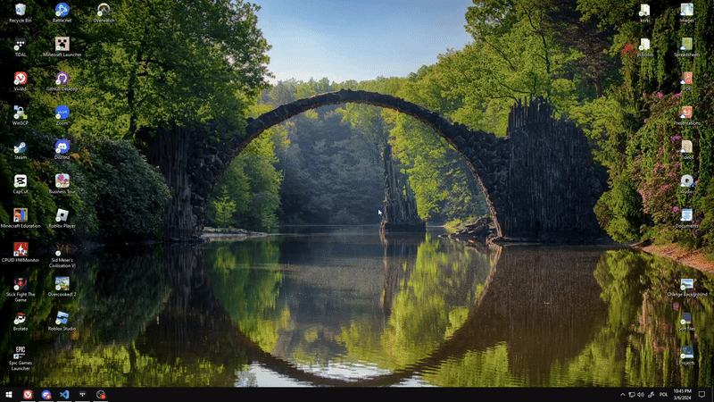

# Wallpaper changer

This script takes a query and changes your desktop wallpaper to a photo from [Pexels API](https://www.pexels.com).
https://www.pexels.com



## Contents

The script itself is written in Javascript and utilizes [wallpaper](https://www.npmjs.com/package/wallpaper) for wallpaper management and [dotenv](https://www.npmjs.com/package/node-fetch) for environment variables.

### Scripts

It comes with two scripts for windows:

-   [`run.vbs`](./run.vbs) - Visual Basic Script providing a simple UI to interact with the script.
    > It's recommended to use this one through a desktop shortcut.
-   [`run.bat`](./run.bat) - A batch script to run the main script with predefined query, for a use in task scheduler to change wallpaper automatically.

## Installation

1. Clone the repository
2. Run `npm install` to install dependencies
3. Create an `.env` file to store your secrets and setup
    > There is an example in [`EXAMPLE.env`](./EXAMPLE.env) file

## Usage

```
npm start [query]
```

Example:

```
npm start nature landscape

```

## Logs

The script stores logs of all wallpapers applied in [`logs.txt`](./logs.txt), just so you can go back to your favourite ones.

## Compatibility

The additional scripts will obviously only work with Windows, but the main script should work on any platform (tested only on Windows)

## Randomness

The script by default will chose a random photo out of 20 search results. You can change this by modifying the number at line 21 in [`index.js`](https://github.com/fajfaj1/wallpaper-changer/blob/cd5eb2d950c73a84f3edac3e83882242f5962374/index.js#L21C30-L21C32).
